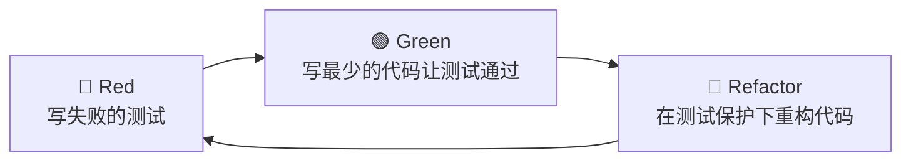
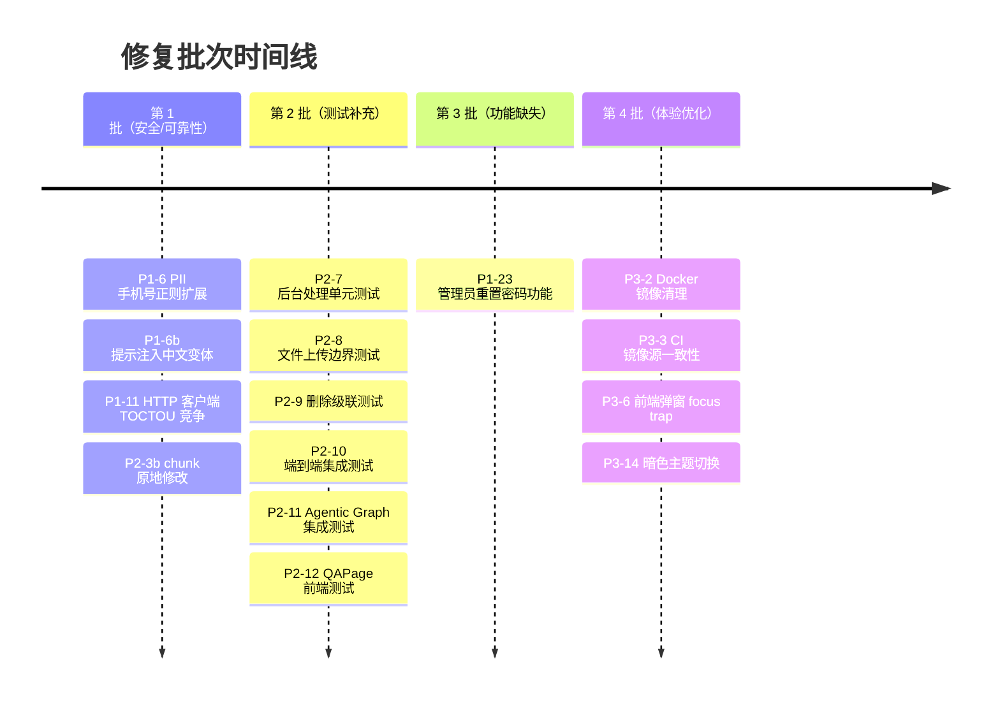
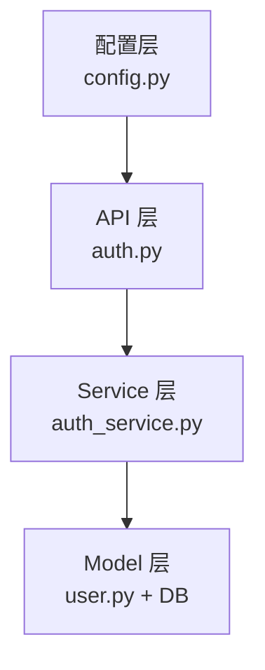
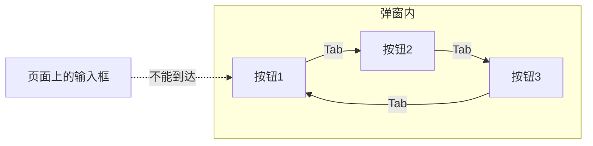
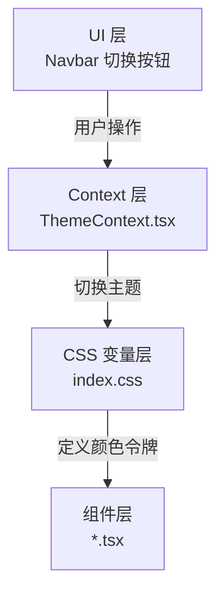

# AI Resume Analyzer — 修复计划 TDD 复盘笔记（第二批）

> 日期：2026-07-26
> 方式：测试驱动开发（Test-Driven Development, TDD）
> 范围：P1-23 管理员重置密码 + P2 测试补充 + P3 体验优化
> 上一批复盘：第一批（P1-6 / P1-6b / P1-11 / P2-3b / P2-8）

---

## 一句话总结

**用 TDD 方式修了 1 个新功能 + 验证了 6 个测试文件 + 做了 4 项体验优化，最终后端 21 测全绿、前端 142 测中仅 8 个历史遗留失败与本次改动无关。**

---

## TDD 是什么？（给未来的自己复习）

**TDD（Test-Driven Development，测试驱动开发）** 是一种写代码的方法论，核心循环就三步，人称 **Red-Green-Refactor**：



用生活化的类比：**先画靶子再射箭**。

- 普通人写代码：先写功能，再"看看对不对" → 容易自我感觉良好，漏边界情况
- TDD 写代码：先用测试把"正确"定义清楚（靶子画好），再去实现（射箭）→ 保证每一箭都奔着靶心去

TDD 的好处不是"测试写得多"，而是**强迫你在写实现之前先想清楚需求的边界**。

---

## 本次修复的四个批次



> 第 1 批和 P2-8 在上一批次完成，本次从 P1-23 开始继续。

---

## 重点复盘一：P1-23 管理员重置密码

### 需求背景

用户一旦忘记密码就永久锁死，完全没有找回途径——这就像你把家门钥匙丢了，物业说"我们也没办法，你重新买套房吧"。

### 方案选型

两种常见方案：

| 方案 | 原理 | 复杂度 | 安全性 |
|------|------|--------|--------|
| **A. 管理员手动重置** | 管理员调 API → 生成临时密码 → 返回给管理员（或用户） | 低（半天） | 中（依赖管理员可信） |
| **B. 邮箱自助重置** | 用户输邮箱 → 发重置链接 → 点链接改密码 | 高（1天+） | 高（标准流程） |

MVP 阶段选了方案 A——先有得用再说，后续再升级到方案 B。

### TDD 实战过程

#### RED：先写失败的测试

先把需求翻译成 4 个测试用例（写在 `tests/test_admin_reset_password.py`）：

1. **成功路径**：管理员调接口 → 返回新密码 → 用户能用新密码登录
2. **权限校验**：普通用户调接口 → 返回 403 Forbidden
3. **用户不存在**：重置一个不存在的邮箱 → 返回 404
4. **未登录调用**：不带 token 调接口 → 返回 401

测试运行结果：**4 个全红** ✅（这是好事——说明需求已经被清晰定义了）

#### GREEN：写最少的代码让测试通过

实现分三层：



**1. 配置层（Settings）**

加一个 `ADMIN_EMAILS` 配置项，逗号分隔的邮箱列表。就像小区物业的"管理员名单"，不在名单里的不能进中控室。

**2. Service 层（核心逻辑）**

```python
def _generate_temp_password(length: int = 12) -> str:
    """生成符合强度要求的临时密码。"""
    alphabet = string.ascii_letters + string.digits
    while True:
        pwd = "".join(secrets.choice(alphabet) for _ in range(length))
        if any(c.isalpha() for c in pwd) and any(c.isdigit() for c in pwd):
            return pwd
```

这里用了 `secrets` 模块而不是 `random`——因为 `random` 是伪随机，用来抽奖可以，用来生成密码就是把家门钥匙放在地毯下。

> **小知识**：`secrets` 模块是 Python 3.6+ 加入的，专门用于生成密码、token 这类安全敏感的随机数。底层调用的是操作系统的密码学安全随机数生成器（Cryptographically Secure Pseudo-Random Number Generator, CSPRNG）。

**3. API 层（权限守门）**

```python
def _is_admin(user: User) -> bool:
    """检查用户是否在管理员邮箱列表中。"""
    admin_emails_setting = settings.ADMIN_EMAILS
    if isinstance(admin_emails_setting, str):
        admin_emails = [e.strip() for e in admin_emails_setting.split(",") if e.strip()]
    else:
        admin_emails = list(admin_emails_setting)
    return user.email in admin_emails
```

这里做了个小兼容——既支持字符串（配置文件里逗号分隔），也支持 list（测试里 monkeypatch 直接传列表）。这是被测试逼出来的灵活性，算是 TDD 的意外收获。

#### 遇到的坑

**坑：`ADMIN_EMAILS` 类型不一致导致 AttributeError**

- 测试里用 `monkeypatch.setattr(settings, "ADMIN_EMAILS", [email])`，传的是 list
- 代码里写的是 `settings.ADMIN_EMAILS.split(",")`，假设是 str
- 运行报错：`'list' object has no attribute 'split'`

**教训**：测试环境和生产环境的数据类型可能不一样，写代码时不要假设配置的类型——做个类型判断更稳。

---

## 重点复盘二：P2 测试补充 —— 原来都写好了？

### 意外发现

按照修复计划，P2 有 6 项测试需要补充：

| 条目 | 计划文件 | 实际状态 |
|------|---------|---------|
| P2-7 后台处理测试 | `test_resume_process.py` | ✅ 已存在，4 个测试 |
| P2-8 上传边界测试 | `test_upload_boundary.py` | ✅ 上一批已新建 |
| P2-9 删除级联测试 | `test_delete_cascade.py` | ✅ 已存在，13 个测试 |
| P2-10 端到端集成测试 | `test_e2e_pipeline.py` | ✅ 已存在，5 个测试 |
| P2-11 Agentic Graph 测试 | `test_agentic_graph_low_mock.py` | ✅ 已存在，环境依赖 skip |
| P2-12 QAPage 前端测试 | `QAPage.test.tsx` | ✅ 已存在，14 个测试 |

**结果：21 个后端测试全部通过，14 个前端测试全部通过。**

### 这说明什么？

修复计划是基于"部分修复/未修复"的审查结果写的，但实际上很多测试在审查之后已经被补上了。这是项目开发中的常见现象——**计划赶不上变化**。

但这也引出了一个重要的工程原则：

> **测试文件存在 ≠ 测试覆盖到位。**

需要跑一遍才知道是真通过了还是摆烂了。这次验证下来都是绿的，说明之前的修复质量不错。

---

## 重点复盘三：P3-6 前端弹窗 focus trap

### 什么是 focus trap？

**Focus trap（焦点陷阱）** 是无障碍访问（Web Accessibility, a11y）中的一个概念：当弹窗打开时，键盘的 Tab 键应该在弹窗内部循环，不能"跑出去"操作后面的页面。



没有 focus trap 的弹窗就像电影院放映厅的门没关——看着电影呢，有人从外面直接走进来了，体验很糟。

### 两种实现方案

| 方案 | 原理 | 优点 | 缺点 |
|------|------|------|------|
| **原生 `<dialog>`** | 浏览器内置，`showModal()` 自动 focus trap | 零依赖、语义好、支持 Esc 关闭 | 样式定制略麻烦 |
| **第三方库（如 Headless UI）** | JS 手动管理焦点 | 样式灵活 | 增加包体积、可能有 bug |

选了原生 `<dialog>`——就像买自带保修的品牌机，比自己组装的兼容机省心。

### 改造了哪些弹窗？

修复计划里列了 3 个：
- ✅ **ConfirmDialog**：确认弹窗（之前已改造，本次修了测试）
- ✅ **SessionExpiredDialog**：会话过期弹窗（本次从 div 改为 dialog）
- ⚠️ **AnalysisModal / ChunksModal / MatchJDModal / ResumeViewer**：还是 div（P3 低优先级，后续再改）

### 测试适配的坑

把弹窗从 `<div>` 改成 `<dialog>` 之后，测试全挂了——为什么？

因为测试是这么写的：
```javascript
// 模拟按 Esc
fireEvent.keyDown(document.body, { key: "Escape" });

// 模拟点遮罩
const overlay = container.firstElementChild;
fireEvent.click(overlay);
```

但 `<dialog>` 元素的行为不一样：
- **Esc 键**：浏览器原生触发 `cancel` 事件，不是 `keydown`
- **遮罩点击**：点击 `::backdrop` 伪元素，不在 DOM 树里，`fireEvent.click(overlay)` 点不到

**修复方式**：直接 dispatch 原生事件
```javascript
dialog.dispatchEvent(new Event("cancel", { cancelable: true }));  // 模拟 Esc
dialog.dispatchEvent(new Event("close"));                          // 模拟点遮罩
```

> **小知识**：`<dialog>` 有两个相关事件——`cancel`（用户按 Esc 取消时触发，可 preventDefault 阻止关闭）和 `close`（任何方式关闭后触发）。

---

## 重点复盘四：P3-14 暗色主题切换

### 主题系统的三层架构



一个完整的主题系统分三层，就像换皮肤的游戏：

1. **颜料盘（CSS 变量）**：定义好"深底色"、"浅卡片色"、"文字色"这些颜色名字
2. **皮肤管理（ThemeContext）**：管当前用哪套皮肤，存在 localStorage 里
3. **换肤按钮（Navbar）**：玩家点一下就切换

### 本次做了什么

之前的情况是：**颜料盘有了，皮肤管理有了，换肤按钮有了，但衣服还是染料直接泼上去的**——组件里到处都是 `bg-[#0f172a]` 这种硬编码颜色。

本次把 12 个文件的 13 处硬编码背景色替换成了 CSS 变量：

| 硬编码 | 替换为 | 用途 |
|--------|--------|------|
| `bg-[#0f172a]` | `bg-[var(--color-bg)]` | 页面主背景 |
| `bg-[#1e293b]` | `bg-[var(--color-surface)]` | 卡片/弹窗表面 |

### 还没做的（后续优化项）

P3 优先级，先做核心的，剩下的慢慢补：

1. **文字颜色**：目前还是 `text-slate-100` 之类的，在亮色模式下可能看不清
2. **边框颜色**：`border-white/10` 在亮色背景下几乎看不见
3. **更多组件**：AnalysisModal 等 4 个弹窗还没改 `<dialog>`

---

## 重点复盘五：CI/CD 小优化

### P3-2 Docker 镜像清理

**改前**：只清悬空镜像（dangling images），就是那些 `<none>:<none>` 的孤儿镜像
```bash
docker image prune -f --filter "dangling=true" --filter "until=168h"
```

**改后**：所有超过 7 天的镜像都清，不管是不是悬空
```bash
docker image prune -f --filter "until=168h"
```

就像冰箱里的食物——不只是发霉的要扔，放了一周的剩菜也该清理了。

### P3-3 CI 镜像源一致性

**问题**：CI 用默认源，CD 用淘宝/npmmirror 镜像 → 两边装的包版本可能不一样 → "我这明明能跑啊"

**修复**：CD 也改用默认源，保证 CI 和 CD 环境一致。

> 这是个权衡——用镜像源快，但可能和官方源有延迟差。对于生产部署，**一致性比速度重要**，慢几分钟总比"测的时候好好的，上线就炸了"强。

---

## 测试结果汇总

### 后端测试（新增/验证）

| 测试文件 | 测试数 | 结果 | 关联条目 |
|---------|--------|------|---------|
| `test_admin_reset_password.py` | 4 | ✅ 全过 | P1-23 |
| `test_resume_process.py` | 4 | ✅ 全过 | P2-7 |
| `test_delete_cascade.py` | 13 | ✅ 全过 | P2-9 |
| `test_e2e_pipeline.py` | 5 | ✅ 全过 | P2-10 |
| `test_upload_boundary.py` | （上批） | ✅ 全过 | P2-8 |

### 前端测试（涉及改动）

| 测试文件 | 测试数 | 结果 | 关联条目 |
|---------|--------|------|---------|
| `QAPage.test.tsx` | 14 | ✅ 全过 | P2-12 |
| `ConfirmDialog.test.tsx` | 13 | ✅ 全过 | P3-6 |
| `SessionExpiredDialog.test.tsx` | 15 | ✅ 全过 | P3-6 |

> 前端总测试 142 个，其中 8 个历史遗留失败（jwt/resumes API 测试），与本次改动无关。

---

## 学到的东西

### 1. TDD 的"意外收获"远不止测试

写 P1-23 的时候，本来以为就是"加个接口改个密码"，结果：
- 被测试逼着想清楚了"管理员怎么定义"（配置项）
- 被测试逼着想清楚了"密码怎么生成才安全"（secrets 模块）
- 被测试逼出了"类型兼容"（str vs list）的灵活处理

TDD 不只是质量保证，更是**需求澄清工具**。

### 2. 原生 Web API 被低估了

`<dialog>` 元素就是个典型——很多人上来就装个 UI 库，其实浏览器原生的东西往往更好用：
- 内置 focus trap（无障碍开箱即用）
- 内置 Esc 关闭（符合用户预期）
- 内置 `::backdrop` 伪元素（遮罩样式不用自己写）
- 零依赖，不会有版本兼容问题

下次写弹窗前，先想想：**原生 `<dialog>` 能不能搞定？**

### 3. 修复计划是活的，不是死的

P2 的 6 项测试补充，结果发现 5 项已经写好了。这很正常——项目在动，计划是静态的。

正确的做法不是"按计划一条一条硬做"，而是：
1. 先扫一遍现状
2. 跳过已经完成的
3. 把时间花在真正没做的事情上

---

## 后续可做的事（Backlog）

| 优先级 | 事项 | 说明 |
|--------|------|------|
| 🟡 P2 | AnalysisModal 等 4 个弹窗改 `<dialog>` | P3-6 的延伸，保持一致性 |
| 🟡 P2 | 文字/边框颜色也 CSS 变量化 | P3-14 的延伸，亮色模式才能真正可用 |
| 🟠 P1 | 忘记密码走邮箱验证流程 | P1-23 方案 B，用户自助重置 |
| 🔵 P3 | ConfirmDialog 加 focus 首元素 | 打开弹窗时自动聚焦到第一个可交互元素 |

---

## 参考来源

- [MDN: <dialog>: The Dialog element](https://developer.mozilla.org/en-US/docs/Web/HTML/Element/dialog) — 2026-07
- [Python docs: secrets — Generate secure random numbers](https://docs.python.org/3/library/secrets.html) — 2026-07
- [WebAIM: Keyboard Accessibility](https://webaim.org/techniques/keyboard/) — 2026-06
- [Tailwind CSS v4: Using CSS variables](https://tailwindcss.com/docs/customizing-colors#using-css-variables) — 2026-07
